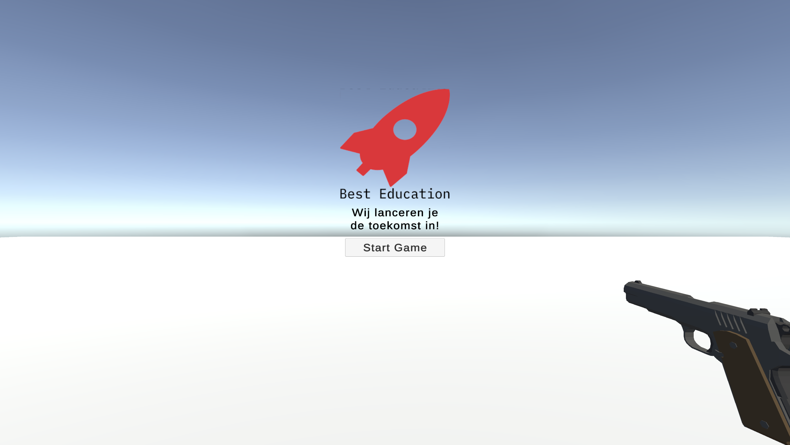
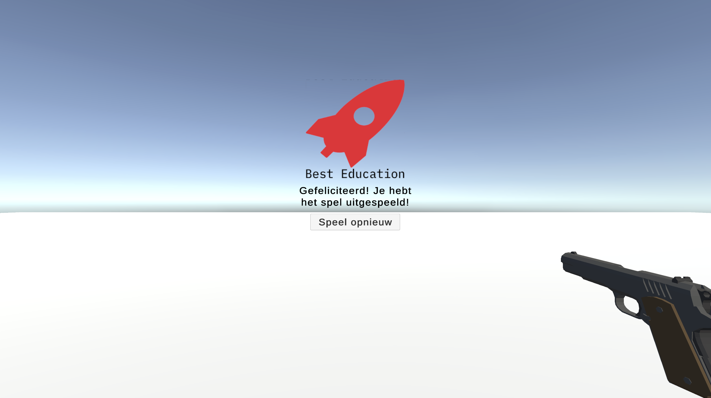

## Introductie
Dit document bevat de verschillende scenario's en criteria voor het testen van de Zombie game.

### Genegieke user stories
De onderstaande lijst aan user stories worden getest in dit testplan:

---

| ID | User story |
| --- | --- |
| US-01 | Als speler wil ik een game kunnen starten |
| US-02 | Als speler wil ik de game, of karakters daarin, kunnen besturen |
| US-03 | Als speler wil ik kunnen winnen. |
| US-04 | Als speler wil ik kunnen verliezen. |
| US-05 | Als speler wil ik een opnieuw starten als ik heb gewonnen of verloren. |
| US-06 | Als Best Education B.V. wil ik dat onze naam, logo en slogan in de game voorkomen. |
| US-07 | Als speler wil ik dat de game moeilijker wordt als ik langer speel. |

### Zombie game specifieke user stories:

---

| ID | User story |
| --- | --- |
| US-08 | Als speler wil ik kunnen bewegen met de w, a, s, d toetsen |
| US-09 | Als speler wil ik kunnen schieten met de linkermuisknop |
| US-10 | Als speler wil ik kunnen zien hoeveel health ik nog heb |
| US-11 | Als speler wil ik kunnen zien hoeveel zombies er nog komen in de wave |
| US-12 | Als speler wil ik kunnen schieten |
| US-13 | Als speler wil ik de zombies kunnen doden door ze te raken met mijn kogels |
| US-14 | Als speler wil ik dat de zombies damage kunnen doen |
| US-15 | Als speler wil ik dat de zombies mij kunnen doden |

## Testplan

### 1. Start the game op (US-01, US-06)
**Hoe**: Start de game door het project in Unity te openen en op de `play` knop te klikken, of door de game te builden en de application op te starten.
**Verwachte uitkomst**: 
1. De game start op en je ziet de `Title screen`, met een knop om het spel te starten.
2. Je ziet de naam van het bedrijf, het logo en de slogan.

### 2. Start de game (US-01, US-02, US-08, US-09, US-10, US-11)
**hoe**: Klik op de `Start Game` knop die in test 1 te zien is.
**Verwachte uitkomst**: 
1. De `Title screen` zou moeten verdwijnen.
2. Je zou met w, a, s, d moeten kunnen bewegen.
3. Doormiddel van je muis zou je de camera moeten kunnen bewegen.
4. Er zou een hud moeten verschijnen waarin je health, de wave en hoeveel zombies er nog komen in de wave te zien zijn.

### 3. Speel de game
**Hoe**: Doordat we in de vorige tests de game hebben gestart kunnen we nu gaan spelen.
**Verwachte uitkomst**:
1. Er zouden om de 3 seconde om je heen nieuwe zombies moeten verschijnen.
*Zie gif van test #2.*

### 4. Kunnen schieten (US-12)
**Hoe:** Doormiddel van linkermuisknop kan je schieten
**Verwachte uitkomst:**
1. Er zou een kogel moeten verschijnen, en die zou rechtdoor moeten vliegen
2. Na 2 seconde zou de kogel moeten verdwijnen
3. De slide van het wapen zou naar achter moeten gaan, en weer terug naar voren
*Zie gif van test #2.*

### 5. De zombies kunnen doden (US-13)
**Hoe**: Door de richten op de zombie en dan te schieten.
**Verwachte uitkomst**:
1. De zombie zou moeten verdwijnen (dood gaan)
2. In de hud zou het cijfer van de hoeveelheid zombies die nog komen in de wave aan 1 naar beneden moeten gaan.
*Zie gif van test #2.*

### 6. De zombies kunnen damage doen (US-10, US-14, US-15)
**Hoe**: Laat een zombie je raken
**Verwachte uitkomst**:
1. Je health zou naar beneden moeten gaan
2. De zombie zou een animatie moeten doen van aanvallen
*Zie gif van test #2.*

### 7. De zombies kunnen je doden (US-04, US-15)
**Hoe**: Laat je health naar 0 gaan
**Verwachte uitkomst**:
1. Je zou dood moeten gaan
2. De game zou moeten stoppen
3. Er zou een `Game Over` scherm moeten verschijnen
4. Op het `Game Over` scherm zou je een knop moeten hebben om de game opnieuw te spelen

### 8. Nieuwe wave starten (US-07, US-11)
**Hoe**: Dood alle zombies in de wave
**Verwachte uitkomst**:
1. De hud zou moeten updaten naar de volgende wave
2. Er meer zombies moeten spawnen
3. De zombies zouden sneller moeten spawnen
4. De zombie count zou moeten updaten naar het nieuwe aantal zombies

### 9. De game opnieuw spelen (US-05)
**Hoe**: Klik op de `Speel opnieuw` knop op het `Game Over` scherm
**Verwachte uitkomst**:
1. De game zou opnieuw moeten starten
2. De score zou gereset moeten worden

### 10. De game winnen (US-03)
**Hoe**: Dood alle zombies en overleef alle waves
**Verwachte uitkomst**:
1. Er zou een `Win` scherm moeten verschijnen
2. Op het `Win` scherm zou je een knop moeten hebben om de game opnieuw te spelen

### 11. De game opnieuw spelen (US-05)
**Hoe**: Klik op de `Speel opnieuw` knop op het `Win` scherm
**Verwachte uitkomst**:
1. De game zou opnieuw moeten starten
2. De score zou gereset moeten worden

